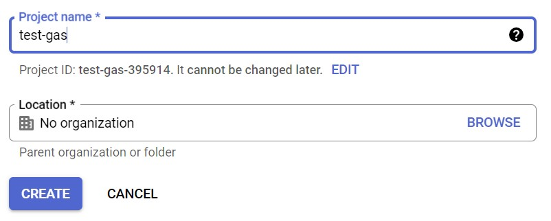
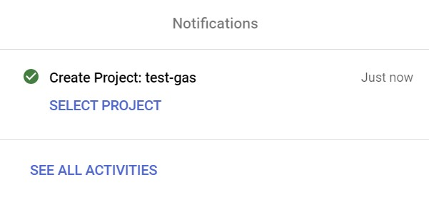
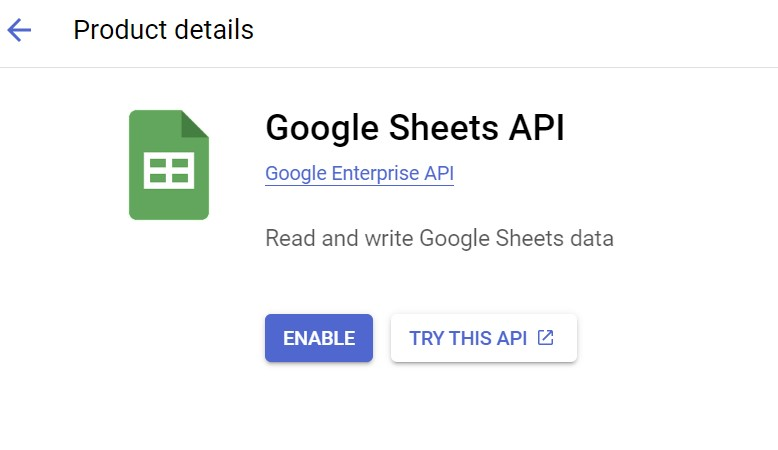
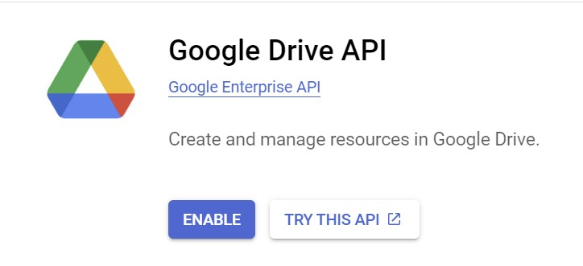

# google-as-template
Base configuration for working with Google Apps Scripts for Google Docs trackers, etc

---
## Overview

This repo is designed as a starting off point for projects that use Google
Apps Scripts, primarily for access with Google Spreadsheets. It has a few
features:

1. Yaml template defining the project
2. Helper scripts to clone/push apps scripts locally for source control
3. Integration with logging (local and/or a remote service) and pytest
4. Standard API functions and AppsScripts designed for spreadsheet projects

---

## Getting started

0. Install the requirements for this repository: 'pip install -r requirements.txt'

1. Setup the project, API, and credentials in Google
   1. Go to [Google Developers Console](https://console.developers.google.com/projectcreate) and
      create a new project

      

      after the project is created, click "Select Project"
      

   2. Go to the [API Dashboard](https://console.cloud.google.com/apis/dashboard) and click
      "ENABLE APIS AND SERVICES"
      

      In the search bar, you'll need to enter "Google Sheets API" and then click through to
      the API and hit "ENABLE"
      

      Do the same things for "Google Drive API"
      

   3. Create [service account credentials to access the api](https://console.cloud.google.com/iam-admin/serviceaccounts/create)
      
      This account is an automation account and is associated with the email account you used
      to create the project:

      

      After creation, assign a role to the account ("Owner" is the most expansive and is
      used here in this example, although you might prefer narrower permissions)
      
      

      Click "DONE" to finish creating the account without granting other users access.
      Google will take you back to a list of service accounts for the project. Click
      the "three dots" options at the right of your new service account and select the
      "Manage keys" option.

      

      Then, click "Add Key"->"Create new key" and select "JSON"

      

      

      Clicking "CREATE" will create the credentials and download a json file to your local
      computer. Use that in the next step.

   4. Save the json file from the prior step in a '.credentials' folder off the main directory
      and rename it as "credentials.json". Also, note the name of the new project you created
      in the last step. (If you forget, it's defined in the second line of the credentials file.)

1. Go to the [Google Apps Script API Python Quickstart](https://developers.google.com/apps-script/api/quickstart/python)
   and follow "Step 1" to create a new console project, enable the API and
   receive credentials. Place the "credentials.json" file in a '.credentials'
   folder off the main directory. Also, note the new project name for later.

2. Edit the settings/settings.yml file as follows (all in google_settings):
   1. Change the project_name setting to the one you created in Step 1.
   2. Change the project_dir setting to the key for your Google Drive folder
      (That's the long string of random letters after the 'folders/' part of the URL)
   3. Change the default script name in script_name
   4. Modify any of the remaining defaults if necessary (especially scopes)

3. Run 'python google_as_manage.py create_project' to do an initial
   authentication and then push a starter script into your project folder.
   A few notes:
   - Depending on what you've done before, you might need to enable the
     specific APIs in you Google account. If this occurs, the script will
     prompt with an error message indicating the URL to do so.
   - After execution, the script outputs a project link. Note that for step 4.

4. At the exit of the "create_project" step, a message printed telling you
   to change the project of the newly created script. In order to execute the
   script using the credentials you already have, you'll need both to have same
   project.
   - Go to the link printed by create_project. If you have multiple Google
     accounts, you might need to switch to the correct account.
   - Copy the "Project Number" under the "Project Info section on the left
   - Go to the newly created script and go to Resources->Cloud Platform
     project...
   - In this dialog, enter the project number you just copied into the blank
     under "Change Project" and then click "Set Project". Hit "Confirm".
   - Close the dialog. You should be ready to execute.

5. In order to run these scripts with the API, you'll need to use a
   "Deployment" in the newly created project. In the project (in the Drive folder):
   - Go to Publish->Deploy as API executable...
   - Copy the "Current API ID" value and replace the '' in
     settings/local_settings.yml next to 'API_ID' with this value 
     then hit close. _(This file is created by step 3.)_

6. Run 'python google_as_manage.py check_creation' to see if everything is
   working. This should list out all of the files in the project folder.

7. _Optional_: setup remote logging
   - By default, all outputs are done via structlog to the console
   - If you'd like to use a remote logger, get the hostname and port for your
     service (e.g. Papertrail)
   - In settings.yml, under the log_settings key at the bottom:
     - Change the xremote_settings key to remote_settings
     - change the values below remote_settings to reflect your hostname and port
   - Change the local_level to an integer representing the desired logging intensity
     to console
   - Run 'python google_as_manage.py test_logging' to see if you get five different
     outputs of different levels to your remote logger

8. _Optional_: Run the example project code to see what a sample use might look like
   - In the main project directory, run 'python example_script.py'
     - You might get an error message telling you to enable a new API (as in step 3.)
       If this happens, enable the API and then run the script again.
   - This will create a four tabbed spreadsheet in your Google Drive folder
     - The first tab is based on the example_data.csv source data in the 'example' folder
     - The second tab is the same as the first, but written with a different method
     - The third tab is written with a third method __and__ adds some calculations
       along with formatting using the Google Apps Script functions loaded to your
       script project when you run this code
     - The fourth tab summarizes the third and also includes Apps Script formatting.
     - The script file used in the last two tabs is in the 'example' folder
     - The end of the script downloads the contents of two tabs to local csv files
   - Be sure to read through the code in example_script.py, because there are very
     extensive comments that talk through the logic of the what and why for each step.
---

## Apps Script tools

### python google_as_manage.py pull_scripts
_and_
### python google_as_manage.py push scripts

The first function allows you to pull scripts from the Google Script project
to the local scripts folder (so you can package or push to git.)

The second does the opposite, allowing you to overwrite the online project
with the local script files.

_Both functions a "destructive" and overwrite the destination._ However, if your
local directory has a script not in the online project, it won't be deleted with
a pull. Similarly, if you have a script in the online project that's not in the
local directory, it won't be deleted with a push. (If that's your intent, you'll
need to do it manually.)

---

## Usage for running script functions

To learn the patterns for calling script and gspread functions, look at the example_script.py file.

It is verbosely commented and is designed to help with getting up to speed on these details.

---

## Notes:

- If you run one of these scripts and get an error like the following:
  - 'AttributeError: 'NoneType' object has no attribute 'access_token'
- Just try again. Testing for this repository didn't see this error, but it
  has occured in the past.

---

## References:

- [Google Quickstart for Apps Script API](https://developers.google.com/apps-script/api/quickstart/python)
- [Google How-to for executing scripts](https://developers.google.com/apps-script/api/how-tos/execute)